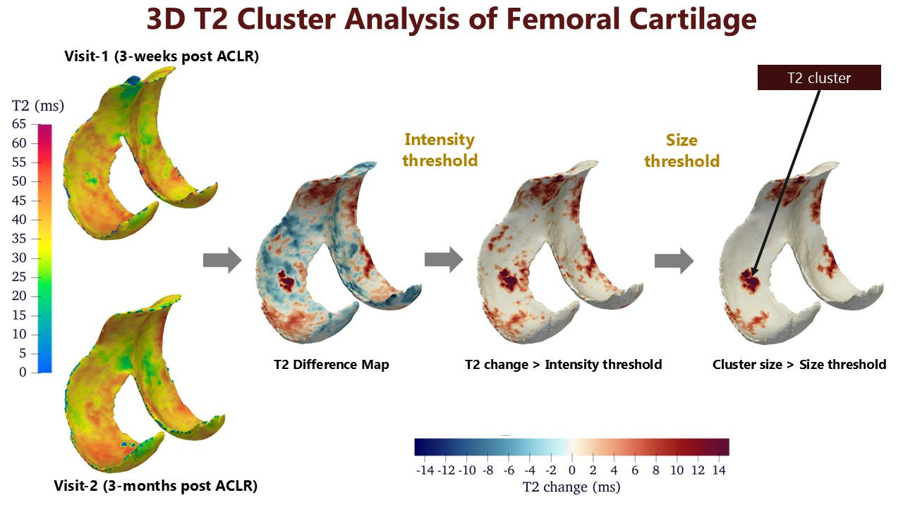

# T2-Cluster-Analysis

#### “T2 cluster analysis” is a quantitative approach for identifying subject-specific contiguous regions of longitudinally increasing (or decreasing) T2 values. Cluster analysis for a subject requires registration of data from two timepoints, calculation of T2 difference maps between the timepoints, and two thresholding steps to identify prominent regions of elevated T2.



## Installation

### Clone the repository to your machine

```
git clone https://github.com/anoopai/T2ClusterAnalysis.git
cd T2ClusterAnalysis
```

#### Install Dependencies

* DOSMA (for bone, cartilage and meniscus segmentation, T2 maps)
* PYMSKT (for dividing femoral cartilage into subregions, 3D visualisations or T2 clusters)
* T2 Cluster analysis (for computing difference maps, intensity and size thresholding)

##### DOSMA

```
# create environment
conda create -n cluster_analysis python=3.8
conda activate cluster_analysis

# install non-python dependcies
conda install anaconda::cmake
conda install conda-forge::lit

# make directory to download and install dependencies
mkdir dependencies
cd dependencies

# Install DOSMA
git clone https://github.com/gattia/DOSMA
cd DOSMA
git checkout bone_seg
pip install '.[ai]'
```

Download DOSMA weights to perform automatic bone and tissue segmentation

```
# To download DOSMA model weights, install huggingface API
pip install huggingface-hub

# Login
huggingface-cli login
```
Once you run the above, you will then input your access token from huggingface. You will need to have/create a hugginface account, and then can get the access token by:

* login to huggingface
* click on user icon in top right
* click settings
* click "access tokens" on the left
* click "Create new token" on left (topish) - Modify Repositories Permission to allow Read/Interact/Write access.
* copy the token and input into the commandline prompt

```
# Download Dosma weights from Huggingface by running the following script
# make sure you are in the main repository (path/to/T2ClusterAnalysis/directory) before you run the script
python download_dosma_weights.py
```

##### PYMSKT

```
cd dependencies

# clone repository
git clone https://github.com/gattia/pymskt.git
  
# move into directory
cd pymskt
  
# INSTALLING DEPENDENCIES
# Recommend pip becuase cycpd and pyfocusr are available on pypi (but not conda)
pip install -r requirements.txt

# IF USING PIP
pip install .
```

##### T2 Cluster Analysis

```
# make sure you are in the main repository (Path/to/T2ClusterAnalysis/) before you install
pip install -r requirements.txt
```

## T2 Cluster Analysis Pipeline

### Step 1: Update config_T2C_analysis_pipeline.json file for the following paths

    # path to your dicom dirctory - Baseline visit
    # If you don't have dicoms directory, input ""
    # "image1_dicom_path": "",
    "image1_dicom_path": "/dataNAS/people/anoopai/T2ClusterAnalysis/data/Subject/VISIT-1/aclr/scans/qdess_dicoms",

    # path to your dicom dirctory - Subsequent visit
    # If you don't have a dicoms directory, input ""
    # "image1_dicom_path": "",
    "image2_dicom_path": "/dataNAS/people/anoopai/T2ClusterAnalysis/data/SubNum/VISIT-2/aclr/scans/qdess_dicoms",

    # path to your qdess nii dirctory - Baseline visit
    # Your qdess directory should be the format that DOSMA uses.
    # qdess
        ├── volumes
        │   ├── echo-000.nii.gz
        │   └── echo-001.nii.gz
        └── qdess.data
    "image1_path" : "/dataNAS/people/anoopai/T2ClusterAnalysis/data/10-P/VISIT-1/aclr/scans/qdess",

    # path to your qdess nii dirctory - Subsequent visit
    # Your qdess directory should be the format that DOSMA uses.
    # qdess
        ├── volumes
        │   ├── echo-000.nii.gz
        │   └── echo-001.nii.gz
        └── qdess.data
    "image2_path" : "/dataNAS/people/anoopai/T2ClusterAnalysis/data/10-P/VISIT-2/aclr/scans/qdess",

    # Path to a directory to save all the outputs and results
    "results_path": "/dataNAS/people/anoopai/T2ClusterAnalysis/data/10-P/VISIT-5/aclr/results",

    # Segmentation Model weights
    "dosma_weights_path" : "/dataNAS/people/anoopai/T2ClusterAnalysis/files/dosma_weights/Goyal_Bone_Cart_July_2024_best_model.h5",

    # path to file containing elastix parameters for registration
    "elastix_registration_parameters_path" : "/dataNAS/people/anoopai/T2ClusterAnalysis/files/elastic_parameters/elastix_registration_parameters_SDF_mask.txt",

    # Cluster type can be:
    # "pos" for increase in T2 with time
    # "neg" for decrease in T2 with time
    "cluster_type" : "pos",

    # Intensity threhsold is in T2 change in ms. You can use this value as default or calculate one for your dataset
    "intensity_threshold" : 12.5,

    # Size threhsold is calculated as number of voxels (size of T2 cluster). You can use this value as default or calculate one for your dataset
    "size_threshold" : 25

### Step 2: Run script

```
python path/to/T2C_analysis_pipeline.py
```

Running the above script will save following files in the results directory

1. Segmentation (femur, tibia, patella, femoral cartilage, tibial cartilage, patellar cartilage, and meniscus) (seg_all)
2. Segmentation of only femoral cartilage (seg_fc)
3. Femoral cartilage mask divided into five subregions (anterior, lateral central, lateral posterior, medial central, medial posterior) (seg_fc_subregions)
4. Image2 registered to Image1 (image2_reg)
5. Segmentation on Image2 after registration (seg2_all_reg, seg2_fc_reg, seg2_fc_subregions_reg)
6. T2 map of the whole image (t2_map)
7. T2 map of the femoral cartilage only (t2_map_fc)
8. T2 map filtered (t2_map_filt or t2_map_fc_filt)
9. T2 difference map (t2_difference_map)
10. T2 difference map intensity thresholded (t2_difference_map_int_threshold)
11. T2 difference map size thresholded (t2_difference_map_size_threshold)
12. Visualisation of registration between qdess from 2 visits (Reg_qdess_slice30.jpg)
13. Visualisation of femoral cartilage masks from Image 1 and registered Image 2.
14. Visualisation of T2 maps before and after filtering for Image 1 and Image 2
15. T2 Clusters assigned to respected FC subregions (t2c_subregions)
16. T2 Cluster analysis results (t2c_results)

Note:
    1. The '_1' or '_2' in the name of a file corresponds to file/data from Image1 or Image2 respectively.
    For example, seg1_fc.nii.gz is the femoral cartilage segmentation for Image1 qdess file.

    2. All image files are stored in NIfTI (.nii or .nii.gz) format
    3. This pipeline uses the intensity and size thresholds computed from our dataset.

### Step 3 (Optional/as needed): Intensity and Size thresholds

Look at T2C_thresholds_custom.ipynb to compute thresholds for your data


## Creating 3D Visualisation

### Step 1: Update config_surface_maps_3D.json file for the following paths

```
    # Enter the path to the T2C Map, T2 difference map, etc (nii format)
    map_path= '/dataNAS/people/anoopai/T2ClusterAnalysis/data/10-P/VISIT-5/aclr/results/t2c_subregions.nii.gz'

    # Enter the path to the corresponding tissue femoral cartilage segmentation file (nii format)
    seg_path = '/dataNAS/people/anoopai/T2ClusterAnalysis/data/10-P/VISIT-5/aclr/results/seg2_fc_reg.nii.gz'
 ```  

### Step 2: Run script

```
python path/to/T2C_analysis_pipeline.py
```

